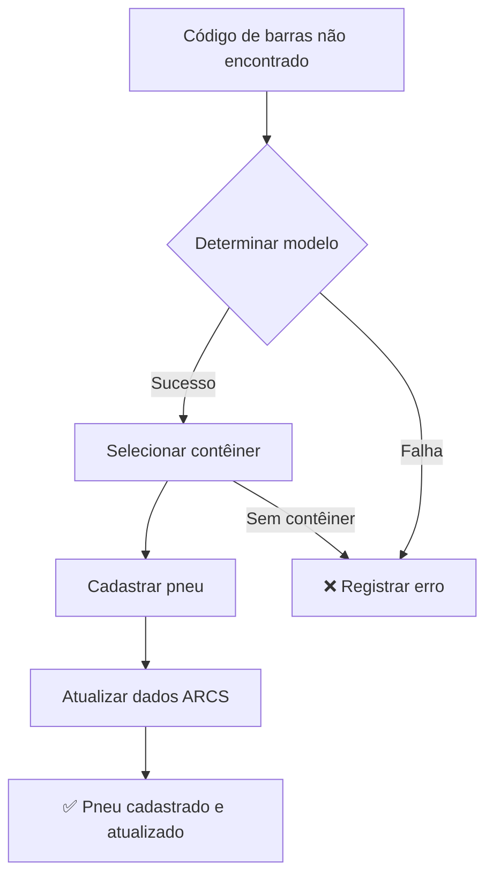

# ARCS Data Update - Lógica de Cadastro Automático

## Visão Geral

O módulo **Atualizar Base de Dados ARCS** agora possui cadastro automático inteligente de pneus. Quando um código de barras não é encontrado no sistema, o pneu é cadastrado automaticamente com base nas informações da planilha.

## Fluxo de Cadastro Automático



## Determinação do Modelo

### Entrada: 3 Campos da Planilha

1. **Tipo** (Coluna H): Identifica se é Slick ou Wet
2. **Categoria** (Coluna C): Identifica 991 ou 992
3. **Lado** (Coluna J): Identifica Dianteiro ou Traseiro

### Tabela de Decisão Completa

| # | Tipo | Categoria | Lado | → Modelo Cadastrado |
|---|------|-----------|------|---------------------|
| 1 | Slick | 991 | Dianteiro | 991 Dianteiro (Slick) |
| 2 | Slick | 991 | Traseiro | 991 Traseiro (Slick) |
| 3 | Slick | 992 | Dianteiro | 992 Dianteiro (Slick) |
| 4 | Slick | 992 | Traseiro | 992 Traseiro (Slick) |
| 5 | Wet | 991 | Dianteiro | 991 Dianteiro (Wet) |
| 6 | Wet | 992 | Dianteiro | 992 Dianteiro (Wet) |
| 7 | Wet | * | Traseiro | 991 e 992 Traseiro (Wet) |

**Nota importante**: Pneus Wet traseiros usam o mesmo modelo para 991 e 992.

## Algoritmo de Detecção

### Passo 1: Identificar Tipo

```typescript
const tipoLower = tipo?.toLowerCase().trim() || '';
const isWet = tipoLower.includes('wet') || tipoLower.includes('chuva');
const tireType = isWet ? 'Wet' : 'Slick';
```

**Exemplos válidos:**
- "Slick" → Slick
- "slick" → Slick
- "Wet" → Wet
- "wet" → Wet
- "Chuva" → Wet
- (vazio) → Slick (padrão)

### Passo 2: Identificar Categoria

```typescript
const categoriaUpper = categoria?.toUpperCase().trim() || '';
const is991 = categoriaUpper.includes('991');
const is992 = categoriaUpper.includes('992');
```

**Exemplos válidos:**
- "991" → 991
- "GT3 Cup 991" → 991
- "Porsche 991" → 991
- "992" → 992
- "Sport 992" → 992
- "Challenge 992" → 992

### Passo 3: Identificar Lado

```typescript
const ladoLower = lado?.toLowerCase().trim() || '';

// Dianteiro
const isDianteiro = ladoLower.includes('diant') || 
                    ladoLower.includes('front') || 
                    ladoLower.includes('e') ||  // Esquerdo
                    ladoLower.includes('d') ||  // Direito
                    ladoLower === 'f';

// Traseiro
const isTraseiro = ladoLower.includes('tras') || 
                   ladoLower.includes('rear') || 
                   ladoLower === 'r';
```

**Exemplos válidos para DIANTEIRO:**
- "Dianteiro" → Dianteiro
- "dianteiro" → Dianteiro
- "Diant" → Dianteiro
- "Front" → Dianteiro
- "E" → Dianteiro (Esquerdo)
- "D" → Dianteiro (Direito)
- "F" → Dianteiro (Front)

**Exemplos válidos para TRASEIRO:**
- "Traseiro" → Traseiro
- "traseiro" → Traseiro
- "Tras" → Traseiro
- "Rear" → Traseiro
- "R" → Traseiro

### Passo 4: Aplicar Regras de Mapeamento

```typescript
let modelName = '';

if (tireType === 'Slick') {
  if (is991 && isDianteiro) modelName = '991 Dianteiro';
  if (is991 && isTraseiro) modelName = '991 Traseiro';
  if (is992 && isDianteiro) modelName = '992 Dianteiro';
  if (is992 && isTraseiro) modelName = '992 Traseiro';
}

if (tireType === 'Wet') {
  if (is991 && isDianteiro) modelName = '991 Dianteiro';
  if (is992 && isDianteiro) modelName = '992 Dianteiro';
  if (isTraseiro) modelName = '991 e 992 Traseiro'; // Compartilhado!
}
```

### Passo 5: Buscar no Banco

```typescript
const model = tireModels.find(m => 
  m.name.toLowerCase().includes(modelName.toLowerCase()) && 
  m.type === tireType
);
```

## Seleção de Contêiner

### Prioridade de Alocação

1. **Primeiro contêiner com espaço** (`current_stock < capacity`)
2. **Primeiro contêiner da lista** (se todos cheios)
3. **Erro** (se nenhum contêiner existe)

```typescript
const defaultContainer = containers.find(c => 
  c.current_stock < c.capacity
) || containers[0];

if (!defaultContainer) {
  throw new Error('Nenhum contêiner disponível');
}
```

## Cadastro do Pneu

### Dados Salvos

```typescript
const newEntry = {
  barcode: normalizedSerial,        // Código normalizado (8 dígitos)
  model_id: model.id,               // ID do modelo detectado
  model_name: model.name,           // Nome do modelo
  model_type: model.type,           // Slick ou Wet
  container_id: defaultContainer.id,
  container_name: defaultContainer.name,
  pilot: record.piloto,             // Da planilha
  status: 'Novo',                   // Status inicial
  created_at: now,
};

await saveStockEntry(newEntry);
```

### Após Cadastro

Imediatamente após o cadastro, o sistema:
1. Atualiza `status` conforme condição (guardado/descartado)
2. Atualiza todos os campos ARCS (numero, categoria, etapa, etc.)
3. Incrementa contador de "Cadastrados"

## Exemplos Completos

### Exemplo 1: Slick 991 Dianteiro

**Planilha:**
```
Tipo: Slick
Categoria: GT3 Cup 991
Lado: Dianteiro
Serial: 1234
```

**Processamento:**
```
1. normalizedSerial = "00001234"
2. isWet = false → tireType = "Slick"
3. is991 = true (contém "991")
4. isDianteiro = true (contém "diant")
5. modelName = "991 Dianteiro"
6. Busca modelo "991 Dianteiro" do tipo "Slick"
7. ✅ Cadastra com modelo encontrado
```

### Exemplo 2: Wet Traseiro (991 ou 992)

**Planilha:**
```
Tipo: Wet
Categoria: Sport 992
Lado: R
Serial: 5678
```

**Processamento:**
```
1. normalizedSerial = "00005678"
2. isWet = true → tireType = "Wet"
3. is992 = true (contém "992")
4. isTraseiro = true (lado = "r")
5. modelName = "991 e 992 Traseiro"  ← Compartilhado!
6. Busca modelo "991 e 992 Traseiro" do tipo "Wet"
7. ✅ Cadastra com modelo compartilhado
```

### Exemplo 3: Esquerdo interpretado como Dianteiro

**Planilha:**
```
Tipo: Slick
Categoria: 991
Lado: E
Serial: 9012
```

**Processamento:**
```
1. normalizedSerial = "00009012"
2. isWet = false → tireType = "Slick"
3. is991 = true
4. isDianteiro = true (lado contém "e" = esquerdo)
5. modelName = "991 Dianteiro"
6. ✅ Cadastra como dianteiro
```

## Casos de Erro

### Erro 1: Categoria não identificada

**Planilha:**
```
Categoria: "GT3" (sem 991 ou 992)
```

**Resultado:**
```
❌ Não foi possível determinar o modelo
Erro: Categoria não contém 991 ou 992
```

### Erro 2: Lado não identificado

**Planilha:**
```
Lado: "X" (não reconhecido)
```

**Resultado:**
```
❌ Não foi possível determinar o modelo
Erro: Lado não identificado (não é dianteiro nem traseiro)
```

### Erro 3: Modelo não existe no banco

**Planilha:**
```
Categoria: 993
Lado: Dianteiro
```

**Resultado:**
```
⚠️ Modelo não encontrado: 993 Dianteiro (Slick)
❌ Não foi possível cadastrar pneu
Solução: Execute SETUP_DATABASE.sql para criar modelos padrão
```

### Erro 4: Sem contêineres

**Resultado:**
```
❌ Nenhum contêiner disponível no sistema
Solução: Cadastre ao menos um contêiner em "Cadastro > Contêineres"
```

## Validações e Segurança

### Validações Aplicadas

1. ✅ Código de barras é normalizado (8 dígitos)
2. ✅ Código não pode ser duplicado (banco rejeita)
3. ✅ Modelo deve existir na tabela `tire_models`
4. ✅ Contêiner deve existir na tabela `containers`
5. ✅ Status inicial é sempre "Novo"
6. ✅ Timestamp automático (`created_at`)

### Integridade Referencial

```sql
-- Foreign keys garantem integridade
FOREIGN KEY (model_id) REFERENCES tire_models(id)
FOREIGN KEY (container_id) REFERENCES containers(id)
```

## Logs de Debug

O sistema gera logs extremamente detalhados para facilitar troubleshooting:

```
📊 Processando 50 registros da planilha ARCS
✅ Dados carregados: 1200 pneus, 7 modelos, 5 contêineres

🔍 Processando: 1234 → 00001234 (Condição: guardado)
🆕 Pneu 00001234 não encontrado. Tentando cadastro automático...
📋 Determinando modelo: categoria=991, lado=Dianteiro, tipo=Slick
✅ Modelo identificado: 991 Dianteiro (Slick)
📦 Contêiner selecionado: Container A (50/100 pneus)
✅ Pneu 00001234 cadastrado automaticamente: 991 Dianteiro no Container A
📝 Atualizando 00001234: Novo → Piloto
✅ Atualizado: 00001234 → Piloto + pilot, numero, categoria, etapa, pista
```

## Performance

### Otimizações

1. **Carregamento único**: Todos os modelos e contêineres são carregados uma vez no início
2. **Busca em memória**: `Array.find()` é muito rápido para listas pequenas (7 modelos)
3. **Salvamento individual**: Cada pneu é salvo individualmente para garantir integridade
4. **Cache local**: Lista de stock_entries é atualizada localmente após cada cadastro

### Escalabilidade

- ✅ Suporta planilhas com milhares de linhas
- ✅ Processamento sequencial garante ordem e consistência
- ✅ Logs permitem rastreamento completo
- ✅ Tratamento de erros individual (um erro não para todo o processo)

## Integração com Supabase

### Tabelas Envolvidas

1. **stock_entries**: Onde os pneus são cadastrados
2. **tire_models**: Origem dos modelos (7 modelos oficiais)
3. **containers**: Origem dos contêineres disponíveis

### API Calls

```typescript
// 1. Carregamento inicial (3 chamadas)
await getStockEntries(true);
await getTireModels();
await getContainers();

// 2. Para cada pneu novo (1 chamada)
await saveStockEntry(newEntry);

// 3. Para cada pneu (novo ou existente) - (1 chamada)
await updateStockEntryByBarcode(barcode, updates);
```

### Row Level Security (RLS)

- ✅ Apenas admins podem importar dados ARCS
- ✅ RLS valida permissões em cada operação
- ✅ Logs de auditoria automáticos

## Troubleshooting

### Problema: Muitos pneus não cadastrados

**Causa provável**: Categoria ou lado com valores não reconhecidos

**Solução**: 
1. Verifique coluna C (Categoria) - deve conter "991" ou "992"
2. Verifique coluna J (Lado) - deve ser reconhecível (dianteiro/traseiro/e/d/r)

### Problema: Todos indo para mesmo contêiner

**Causa**: Primeiro contêiner sempre tem espaço

**Solução**: Normal. Sistema usa primeiro contêiner com espaço. Se quiser distribuir, cadastre pneus manualmente em outros contêineres depois.

### Problema: Erro "Modelo não encontrado"

**Causa**: Banco de dados sem modelos cadastrados

**Solução**: Execute `SETUP_DATABASE.sql` no Supabase

## Compatibilidade

- ✅ Compatível com planilhas ARCS antigas
- ✅ Compatível com novos formatos
- ✅ Retrocompatível (continua atualizando pneus existentes)
- ✅ Não afeta dados já cadastrados

## Conclusão

O cadastro automático torna a importação ARCS totalmente autônoma e inteligente. O sistema agora pode:

- 🎯 Processar planilhas completas sem intervenção manual
- 🧠 Identificar modelos automaticamente
- 📦 Alocar pneus de forma inteligente
- 📊 Manter histórico completo de logs
- ✅ Garantir consistência total dos dados

**Resultado**: Importação 100% automatizada com zero intervenção humana.
